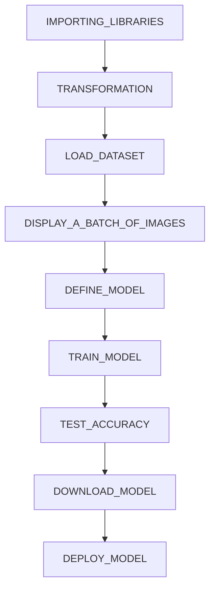

<h1 align="center"  >Face Mask Detection Using Machine Learning</h1>

  

 ## TABLE OF CONTENTS
 
- Abstract 
- About Project
- Research Questions
- Prerequisites
- Dataset
- Roadmap
- Preprocessing
- Results and Discussion
- Conclusion
- References
- Instructions

 ## ABSTRACT
As we know that Covid-19 is almost ended and majority of the countries have removed the restriction to wear mask at every places.After ending the pandemic what is the use of this model everyone think that. Nowadays ,indusrilization have changed the world at global level in each and every field such as healthcare , chemical ,technology , and many more. Visit to the madicap company ,which is making various medicines.The idea came from that visit that surgical mask is mandatory at that place becuase their employers deal with various substance which will affect their body in bad way if that substance directly goes to their body.What is more, they have to keep security person to check each and every person that wearing mask or not? Creating the autonomus model using the various machine learning techniques will reduce the burden of doing manual work and considering the health of their workers will prove best solution for them.

 ## ABOUT PROJECT
This project that I created will present dataset to detect the face masks.Collected the data from various sources with different mask catergories.Dataset is used to train and test the machine learning model.there are certain images in our dataset from various backgorund , image from front face and side by side.

 ## RESEARCH QUESTIONS
 - Person is wearing mask or not?

 - Which kind of mask is person is wearing from 5 categories?
 

 

 ## PREREQUISITES
 >Software
  #### You can use any of this to run the code:

- Pycharm
- Anaconda
- Visual Studio Code
- You can run on your google collaboratory

>Libraries
#### All listed library must be installed using -> ***!pip install (library name)***  in command line.
Jupyter notebook
- torch
- numpy
- matplotlib
- pandas

## DATASET

Dataset is maily collected from google images and kaggle dataset according to requriment of my model.
>Their are five categories in dataset.
- Cloth mask
- Without mask
- Surgical mask
- N95 mask
- N95 mask with valve

I have used ImageLoader for file and image reading, so if you want to run the notebook you have to change the file location accordingly. You can do same on google colab to by uploading and mounting files on drive.

>Dataset is divided in to 2 parts Train adn Train:

## ROADMAP

## PREPROCESSING
I have used convolution neural netowork to define model and test the model.
A CNN is also known as a Convolution Neural Network(CNN), consisting of several different network architectures such as convolution, pooling, normalization, and Perceptron. Each one has different characteristics. 
1. Convolution Layer
2. Normlization Layer
3. Perceptron Network
4. Loss function
5. Optimizer

>[HOW CONVOLUTION NEURAL NETWORK WORKS](https://github.com/gatisonani/FaceMasKDetection/blob/master/How_Convolution_Neural_Network_works.pdf).

## RESULT AND DISCUSSION

#### **Graphical representation of training and testing percentage of model.**

>Plot shows accuracy after running each epoch.

####  **Evaluation**

>In this multiclass classification I have classified the images in five different categories of masks, that’s N95, N95 with valve, No Mask, Surgical masks and finally the cloth masks. For that I have trained the model using previously mentioned parameters and hyper parameters. For testing, I have selected 16,542 different images which are scattered amongst those five classes. We have achieved the accuracy of almost 83%% with accuracy, precision and F1-score mentioned in the metrics table below along with the confusion matrix.

>Matrics table with accuracy,precision ,F1 score, and recall.

| Matric    | Score |
| --------- | ----- |
| Accuracy  | 0.81  |
| Precision | 0.65  |
| F1 Score  | 0.67  |
| Recall    | 0.73  |

## CONCLUSION

The model might be facing an issue of high variance as we are able to achieve an accuracy of 93% during the training period but it is providing around 81% accuracy for the test dataset. It is relatively good however we can improve it by following certain approaches such as regularization, early stopping and cross validation.

## REFERENCES

1. Google Images
2. [Kaggle, Face Mask Detection 12K Images Dataset](https://www.kaggle.com/datasets/ashishjangra27/face-mask-12k-images-dataset).
3. [SMOTE: Synthetic Minority Over-sampling Technique](https://arxiv.org/abs/1106.1813).
4. [Deep Learning for image classification w/ implementation in PyTorch](https://towardsdatascience.com/convolutional-neural-network-for-image-classification-with-implementation-on-python-using-pytorch-7b88342c9ca9).
       
       
 ## INSTRUCTIONS
 There are few steps you have to follow to check the prediction.
1. You must install specific software.
2. [Data](https://github.com/gatisonani/FaceMasKDetection/tree/master/Dataset-main)-download data from the link and upload it into to your drive, change the path in ipynb file to load the data.
3. Install all required libraries in your environment which are listed above.
 
 
 Additionally, there is 
 - [Jupyter notebook - FinalCNNCapstone.ipynb](https://github.com/gatisonani/FaceMasKDetection/blob/d91462ae6ac1750b95469c369acb675fbed35924/FinalCNNCapstone.ipynb)
 -  [Html file of Jupyter notebook - FinalCNNCapstone.html](https://github.com/gatisonani/FaceMasKDetection/blob/d91462ae6ac1750b95469c369acb675fbed35924/FinalCNNCapstone.html)
 -  [Saved Model - FinalmaskModel.pt](https://github.com/gatisonani/FaceMasKDetection/blob/d91462ae6ac1750b95469c369acb675fbed35924/FinalmaskModel.pt)
 
